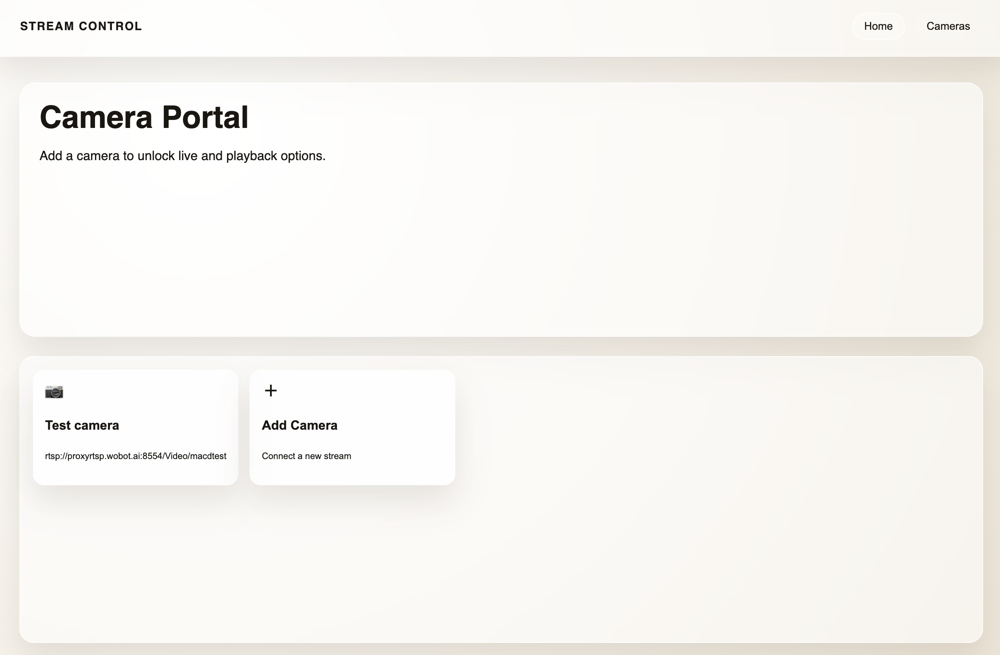
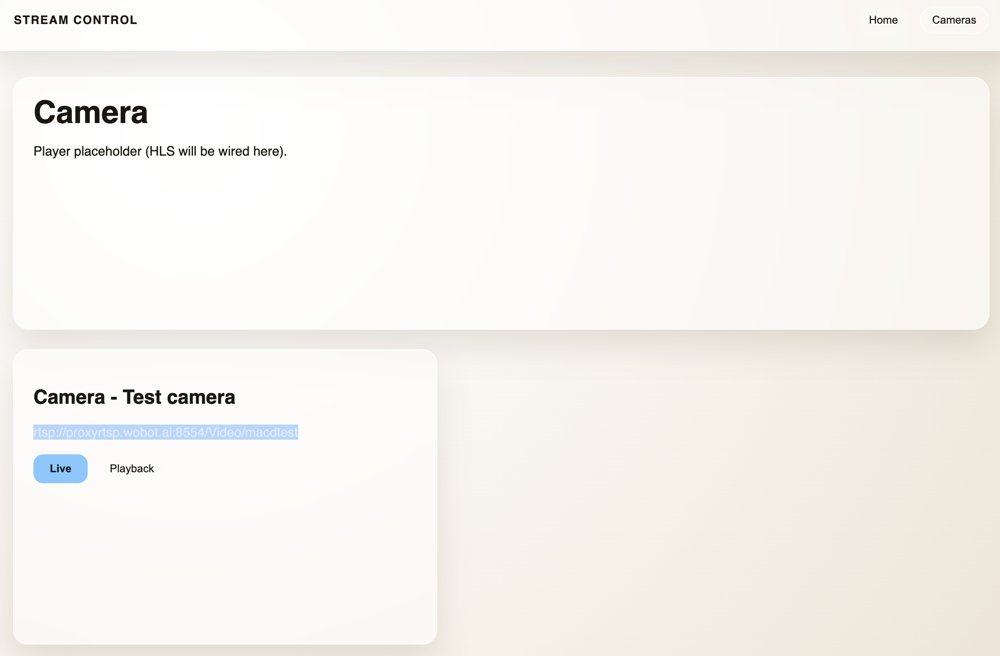

### Video management system
This is a simple open-source video management system application using the tech-stack,
| Tech | Framework | 
|---|---|
| C++ | FFmpeg | 
| Python | FastAPI |  
| Js | VITE | 
| DB | JSON |

Features:
- Add a camera with configurable storage limit
- View live streaming at different qualities
    - high
    - medium
    - low
- View plaback up-to storage limit, post which data is automatically deleted

## Overview
- FastAPI backend in `backend/` manages cameras, starts the native streamer, and serves HLS playlists via `/api/cameras/...` and `/streams/...`.
- React/Vite frontend in `frontend/` consumes the API, plays HLS with Hls.js, and lets you add/select cameras.
- Native streamer in `src/` (C++ with FFmpeg via Meson/Ninja) pulls RTSP and outputs HLS renditions (copy, low, mid, high) under `backend/streams/<camera_id>/`.

## Install and run (dev)
1) Build streamer (one-time or when sources change)
```
meson setup build .
meson compile -C build
```

2) Backend (FastAPI)
```
cd backend
python -m venv .venv
source .venv/bin/activate
pip install -r requirements.txt
uvicorn main:app --host 0.0.0.0 --port 8000
```

3) Frontend (Vite/React)
```
cd frontend
npm install
# optional: export VITE_API_BASE="http://localhost:8000"
npm run dev -- --host --port 5173
```

## API quick reference
- POST `/api/cameras` -> create camera and start streaming (body: `name`, `rtsp_url`, optional `max_playback_minutes`).
- GET `/api/cameras` -> list cameras.
- GET `/api/cameras/{id}/live.m3u8?quality=copy|low|mid|high` -> live playlist (defaults to copy/index.m3u8).
- GET `/api/cameras/{id}/playback.m3u8?quality=high|mid|low|copy` -> playback playlist (defaults to high/index_high.m3u8).
- HLS files served from `/streams/<camera_id>/`.

## Frontend media placeholders
- Home: 
- View cameras: 
- Video demo: TODO add short walkthrough (place in frontend/static/ and link here).

## Notes
- Ensure `STREAMER_BIN` env points to the built `build/streamer` binary if not in default location.
- HLS segment retention is controlled by the streamer flags (see `main.py` defaults or override via env vars `COPY_HLS_TIME`, `ENCODE_HLS_TIME`, `COPY_KEEP_MIN`, `ENCODE_KEEP_MIN`).
